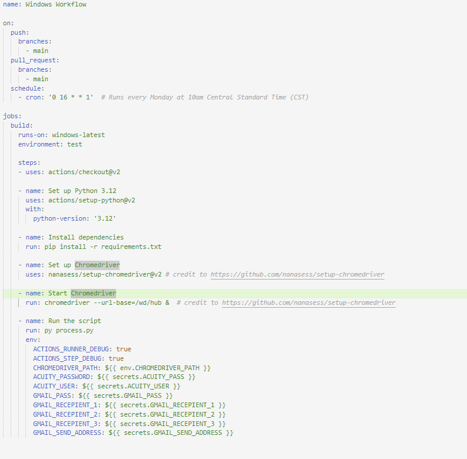
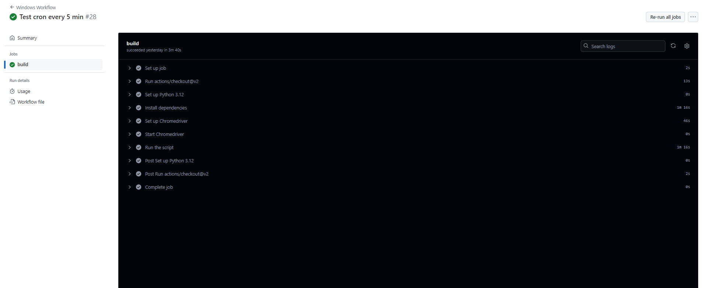
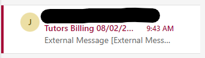
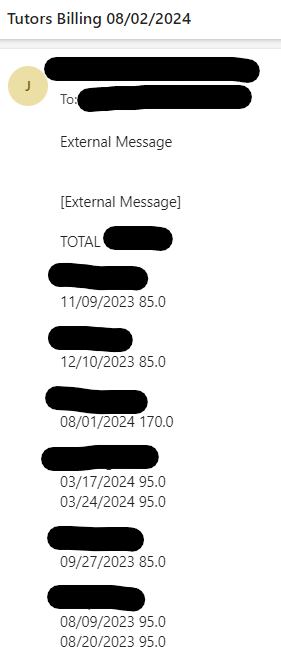

# Automated Billing Report Generator 

## Overview
This project automates the generation and delivery of billing reports for unpaid tutoring sessions for clients of [The Tutors](https://thetutorsmemphis.com) located in Memphis, TN. It uses a Python script to pull data from Acuity using Selenium, processes the data with Pandas and Numpy, and sends the cleaned data via email to my supervisors. The process is automated using GitHub Actions, ensuring that updated reports are sent at regular intervals.

## Features
- **Data Extraction**: Pulls data from Acuity using Selenium.
- **Data Processing**: Uses Pandas and Numpy to process and analyze the data.
- **Report Generation**: Converts processed data into a text file.
- **Email Automation**: Sends the text file via email to supervisors.
- **Automated Execution**: Runs the script automatically at regular intervals using GitHub Actions.

## Requirements
- **Python 3.12**
- **Selenium**
- **Pandas**
- **Numpy**
- **Chromedriver** (for Selenium)
- **GitHub Actions** (for automation)

## Setup
### Prerequisites

1. **Install Python 3.12**

2. **Install Required Python Libraries:**
`pip install selenium pandas numpy`

3. Setup Chromedriver:
Ensure that Chromedriver is installed and configured correctly. See `windows_build.yaml` for details.

## Configuration
1. **Acquiring Secrets**:
      - **Acuity API Credentials**: Store your Acuity API credentials (username, password) as GitHub secrets.
2. **GitHub Actions Configuration**:
      - Update your GitHub Actions workflow file to include the necessary secrets and environment variables.

## Usage
1. **Script Execution**:
The script `process.py` performs the following tasks:
    - **Extract Data**: Uses Selenium to login to Acuity and download the billing data as a CSV file.
    - **Process Data**: Reads the CSV file, processes it using Pandas and Numpy, and calculates unpaid amounts.
    - **Generate Report**: Converts the processed data into a text file format.
    - **Send Email**: Sends the text file via email to specified recipients.

2. **Automated Execution**:
- The GitHub Actions workflow is configured to run the script at regular intervals (every X minutes, days, or weeks). The interval is defined in the cron schedule of the workflow file.

## GitHub Actions Workflow
Here is the GitHub Actions workflow configuration that schedules the script to run automatically:

## Screenshots
### Output of succesful build:

### Email received in inbox:

### Email opened:

## Troubleshooting
- **Chromedriver Issues**: Ensure Chromedriver is compatible with your version of Chrome.
- **Data Extraction Errors**: Verify your Acuity credentials and the accessibility of the data.
- **Email Delivery Problems**: Check email configuration and recipient addresses.

## License
This project is licensed under the MIT License - see the LICENSE file for details.
